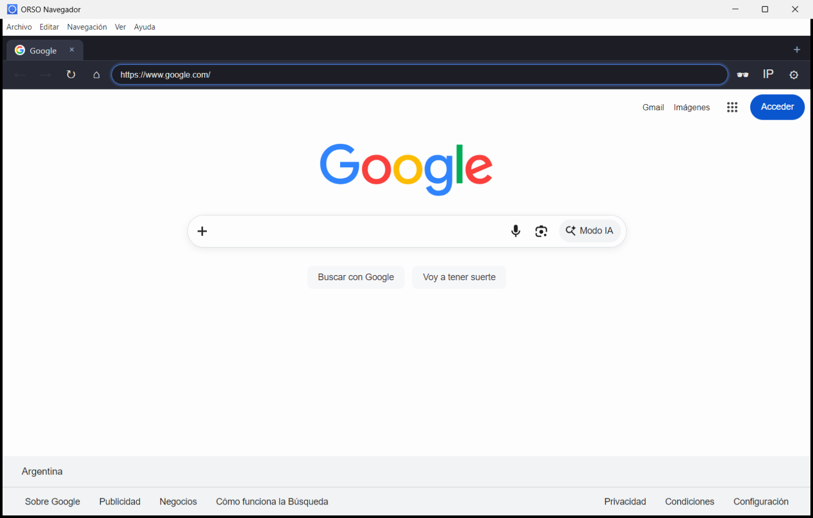
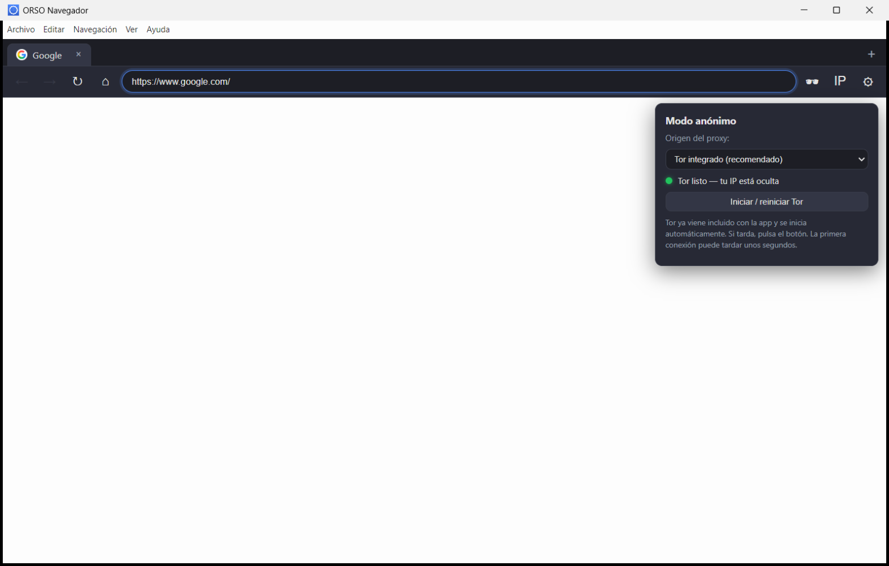

# ORSO Navegador
#### Descarga el ejecutable desde (https://drive.google.com/file/d/10WKIS1qrmlUEsDkEqJYuuYVsZrcUl_Yt/view?usp=sharing)
Navegador web nativo de escritorio construido con **Electron y JavaScript puro** (sin frameworks de UI), con **Tor integrado** para navegación anónima.

El resultado final es un **único `.exe` portátil** que incluye el navegador **y** Tor: no requiere instalar nada más.

---

## Capturas de pantalla

**Navegación normal:**



**Modo anónimo (panel de Tor/proxy):**



---

## Características

- **Pestañas**: crear, cerrar, cambiar, favicon y título por pestaña.
- **Navegación**: atrás, adelante, recargar/detener, inicio y barra de direcciones inteligente (detecta URL vs. búsqueda en Google; admite IPs y `localhost`).
- **Sesiones separadas**:
  - Pestañas normales → sesión persistente (`persist:orso`, guarda cookies/historial).
  - Pestañas anónimas → sesión **en memoria** (`anon`, no guarda nada) y salen por un proxy.
- **Modo anónimo (ocultar IP)** con tres orígenes de proxy:
  1. **Tor integrado** (recomendado): el binario de Tor viene dentro de la app y se arranca automáticamente.
  2. **Proxy manual**: SOCKS5/HTTP configurado por el usuario.
  3. **Proxy público**: lista descargable de proxies SOCKS4/SOCKS5/HTTP.
- **Verificación de IP**: botón que comprueba con `check.torproject.org`.
- **Cierre limpio de Tor**: al salir, la app apaga Tor (apagado limpio + cierre forzoso si no responde), libera la memoria y borra el `lock`.

---

## Requisitos

- **Windows 10/11** (usa el runtime **WebView2**, que ya viene incluido en Windows).
- Node.js ≥ 18 (solo para **desarrollo/compilación**; el `.exe` final no necesita Node).

> El runtime WebView2 de Microsoft ya está preinstalado en Windows 10/11; no hay que instalar nada.

---

## Ejecutar en desarrollo

```powershell
cd C:\Users\Mario\Documents\ORSO\orso-navegador
npm install
npm start
```

## Compilar el `.exe` portátil

```powershell
npm run dist
```

El ejecutable se genera en:

```
dist\ORSO-Navegador-1.0.0.exe
```

Es un **ejecutable portátil** (un solo archivo, ~72 MB): cópialo donde quieras y ábrelo con doble clic.

---

## Uso

### Navegación normal

Escribe en la barra una dirección (`github.com`, `https://...`, una IP) o un texto para buscar en Google.

### Modo anónimo (ocultar la IP)

1. Pulsa **🕶️** en la barra (o `Ctrl+Shift+N`). Se abre una **pestaña anónima** (indicada con un punto morado).
2. Navega desde esa pestaña: el tráfico sale por **Tor** (o el proxy elegido), ocultando tu IP real.
3. Pulsa **IP** para verificar que realmente sales por Tor.
4. En **⚙️** puedes ver el estado de Tor, reiniciarlo o elegir otro origen de proxy.

**Primera vez**: Tor tarda ~1 minuto en establecer su circuito; las siguientes ejecuciones son mucho más rápidas (~5–10 s). Mientras arranca, el estado muestra el porcentaje y las pestañas anónimas se reintentan solas cuando queda listo.

---

## Cómo funciona Tor en la app

- Se empaqueta el **Tor Expert Bundle 15.0.22** (`tor/tor.exe` + `geoip`/`geoip6`) dentro del `.exe` vía `extraResources`.
- Al iniciar, la app arranca `tor.exe` en un **puerto dedicado**:
  - SOCKS: `127.0.0.1:19050`
  - Control: `127.0.0.1:19051`
- El proxy se aplica solo a la **sesión anónima** (`session.fromPartition('anon')`), de modo que las pestañas normales siguen yendo directas.
- Al cerrar la app, Tor se apaga de forma limpia (`SIGNAL SHUTDOWN` por el puerto de control) y, si es necesario, se fuerza su cierre; también se borra el `lock` para que la próxima ejecución arranque sin conflictos.
- Si una ejecución anterior se cerró de forma abrupta y dejó un Tor huérfano, la app lo detecta y lo apaga antes de arrancar el suyo.

---

## Estructura del proyecto

```
orso-navegador/
├── main.js                  # Proceso principal: ventana, menú, IPC, Tor y proxies
├── preload.js               # Puente seguro (contextBridge) hacia el renderer
├── renderer/
│   ├── index.html           # Interfaz (pestañas + barra de herramientas)
│   ├── styles.css           # Estilos (tema oscuro)
│   ├── renderer.js          # Lógica de pestañas, navegación y modo anónimo
│   └── newtab.html          # Página de nueva pestaña (accesos rápidos)
├── assets/                  # Iconos (icon.png / icon.ico)
├── scripts/                 # Generadores del icono (PNG e ICO)
├── tor/                     # Tor Expert Bundle (tor.exe + geoip)
├── package.json             # Dependencias y configuración de electron-builder
└── dist/                    # Salida del build (ORSO-Navegador-1.0.0.exe)
```

---

## Atajos de teclado

| Acción                  | Atajo            |
| ----------------------- | ---------------- |
| Nueva pestaña           | `Ctrl+T`         |
| Cerrar pestaña          | `Ctrl+W`         |
| Atrás / Adelante        | `Alt+←` / `Alt+→`|
| Recargar / Detener      | `Ctrl+R` / `Esc` |
| Enfocar barra de URL    | `Ctrl+L`         |
| Inicio                  | `Alt+Home`       |
| Modo anónimo            | `Ctrl+Shift+N`   |
| Pantalla completa       | `F11`            |

---

## Avisos importantes

- **Proxies públicos**: son inestables y **no cifran tu tráfico**; úsalos solo como alternativa puntual. La opción segura es **Tor**.
- **Sin firma de código**: el `.exe` no está firmado, por lo que Windows SmartScreen puede mostrar una advertencia la primera vez. Pulsa *Más información → Ejecutar de todas formas*.
- **Anonimato**: Tor oculta tu IP, pero el anonimato total depende del uso (no inicies sesión en servicios personales, etc.). Consulta las [recomendaciones de seguridad de Tor](https://support.torproject.org/faq/staying-anonymous/).

---

## Licencia

MIT. Tor es un proyecto de [The Tor Project](https://www.torproject.org/) y se distribuye según sus propios términos.
